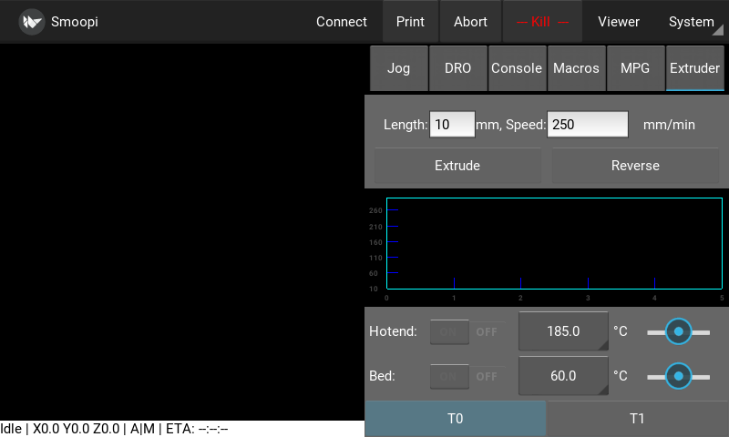
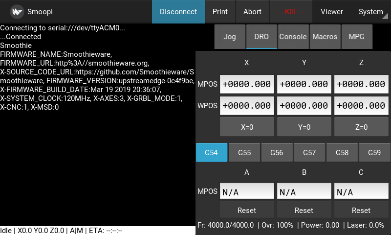
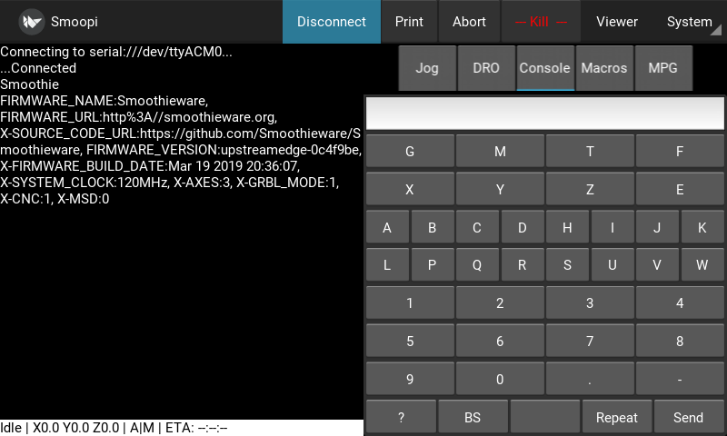
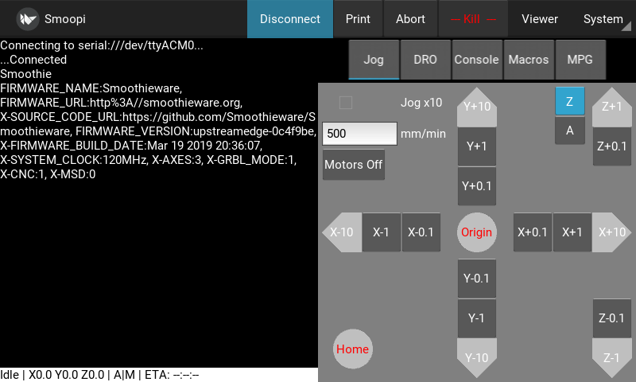
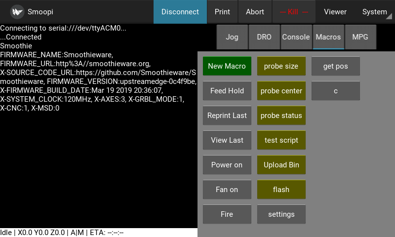
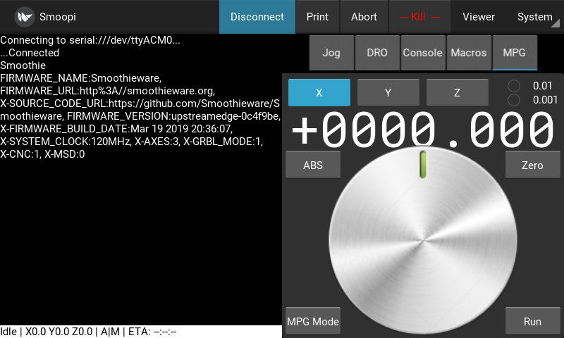
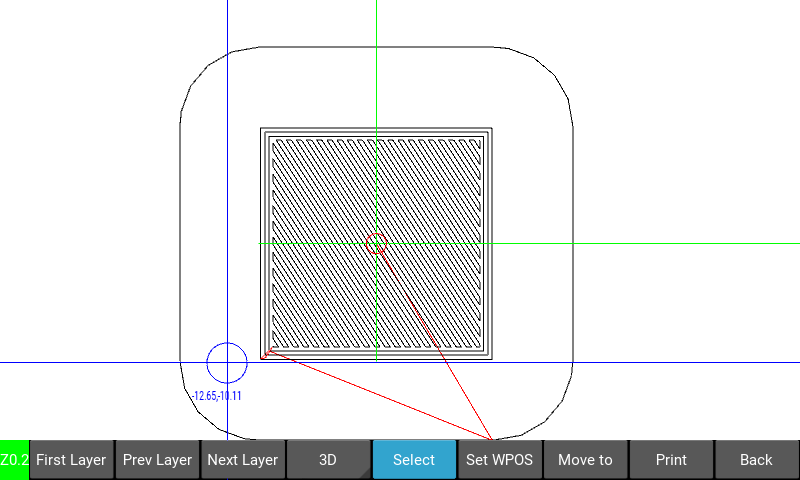
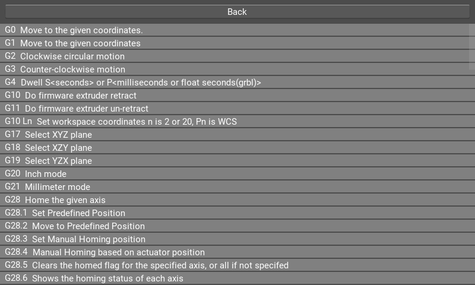
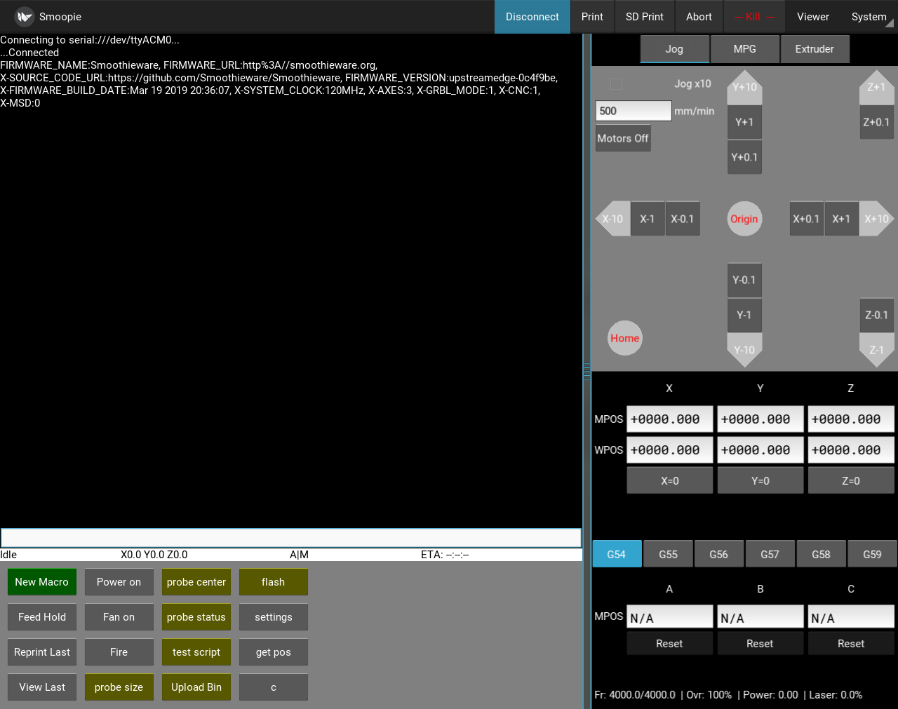
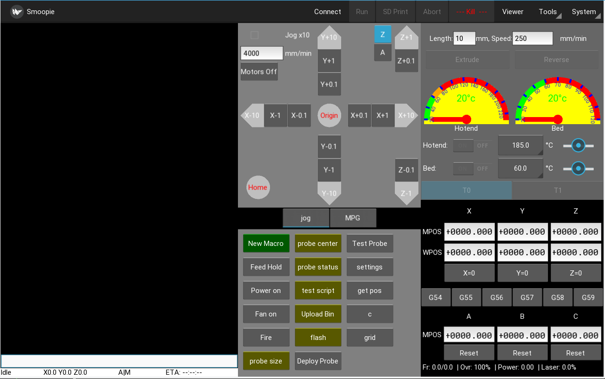

# Smoopi
A Smoothie host designed to run on an rpi with multitouch screen or on a desktop with a mouse and keyboard.

This is stable and ready for everyday use.

This uses python >= 3.5 and < 3.8 and kivy >= 1.11.0

Use an RPI-3 Model B or B+, or the RPI-3 Model A+ with RPI multitouch screen. (No XWindows, but multitouch is required if there is no keyboard or mouse).
Also runs on pretty much any Linux XWindows desktop (and maybe Mac).

Runs very nicely on a RPI-4b with 4GB memory under XWindows with an external HDMI monitor running Buster. (Touch screen has not been tested on the RPI-4).

It will run on Windows if you install Python 3.5.2 (or newer), and follow the kivy instructions for installing kivy on windows. https://kivy.org/doc/stable/installation/installation-windows.html

NOTE it has been briefly tested on python versions >= 3.8 with Kivy 2.0RC and appears to work under a Ubuntu desktop XWindows, it has not been tested on a touch screen though.

The minimum usable resolution is 800x480.

## Goal
The goal is to have a small touch screen host that can run a smoothie and is better than an LCD Panel, and almost as good as a host PC running pronterface.
It is not meant to be a replacement for say Octoprint whose goals are different.
A secondary goal is to have a decent smoothie aware desktop host to replace Pronterface and bCNC, that has good support for CNC tasks as well as 3D printing. The CNC goals are to allow setting of the WCS to a point on the workpiece, and move to points on the workpiece to check for placement etc.

(*UPDATE* there are several desktop layouts that make it more usable on a regular desktop that has a larger screen, it has been tested on various linux machines but should run anywhere that python3 and kivy will run).

An RPI with 7" touch screen is about the same price as the better LCD panels, and makes a great standalone controller for a 3D printer.

## Usage

Run as ```python3 main.py``` and it MUST be run from the smoopi directory.

To select the port to connect to click the System menu and select Port, then select the serial port from the list, or for a network connection select Network...
then enter the host or ip optionally followed by the port :23 (23 is the default if not specified), eg smoothieip or 192.168.0.2:23 (NOTE network communication is not well tested).
Once you have selected a port to connect to it is saved in the ini file, and you can then click the connect menu item to connect.

The left screen is the console and displays messages from smoothie, the right screen is a selection of panels (Modes) which can be switched to using the tabs to select the panel you want, you can scroll the left screen up and down by swiping up or down.

There is a status bar at the bottom left showing status, DRO and print ETA when printing.

You can select 3d printer mode or CNC mode from the Settings menu, this can affect what Panels are available amongst other minor changes.

- The Console panel has a keyboard for entering gcodes and if you touch the edit field a keyboard will pop up for typing commands (non gcodes). If you precede the command with ! it will be sent to the linux shell instead of smoothie. Sending ? will pop up a GCode reference screen.
- The Extruder Panel is used to control temperatures and extuder. You can switch between gauge view and graph view by double clicking on the view
- The Jog Panel has the usual jog controls, plus a continuous jog mode in the middle (which can only be pushed in one direction before release).
- The Macro Panel is a user configurable buttons panel to control whatever you want. (Edit the `macros.ini` file)
  There is a `sample-macros.ini` just copy that to `macros.ini` and edit as appropriate to define your own macro buttons.
- The DRO Panel shows current MCS and WCS, and allows easy selection of the WCS to use, and allows setting of WCS. If WCS entered is ```/2``` it will halve the current position. (Usefull for moving to the center of things)
- The MPG Panel is a simulation of an MPG pendant, it allows control of movement and feedrate override via a simulated rotary knob. (There is an optional module to take controls from a real MPG USB pendant).
- The config editor displays the current smoothie config in a scrollable window, values can be updated click the return key and then will update the config on sd accordingly. (reset is of course required to take effect).
- Under the Tools menu there is an entry to upload GCode files to the sdcard, and to start an sdcard based print. (don't try to upload non gcode files)
- There is a Fast Stream Tool for streaming gcode that has very small segments and stutters under normal streaming (or for raster laser engraving)

There is a gcode visualizer window that shows the layers, or for CNC allows setting WPOS and moving the gantry to specific parts of the Gcode...
Click the Viewer menu item, select the file to view, then the layers can be moved up or down.
To set the WPOS to a point in the view click the select button, then touch the screen to move the crosshairs, when you have the point you want selected then click the set WPOS button, that point will be set as WPOS. To move the gantry to a point on the view click the select button, then touch and drag until you get the point and then click the move to button, the gantry will move to that point.

The Kivy file browser is pretty crude and buggy. To allow it to be usable on a touch panel I had to set it so directory changes require double taps on the directory. I also do not enable the Load button unless a valid file is selected by tapping the file. This allows swiping to scroll the file lists to work reliably. 
If running in desktop mode you can select a different native file chooser from the settings page. (You will need to install zenity or kdialog or wx for python3)

The Update System menu entry requires git to be installed and the running directory be a valid git repo pointing to github.

When running on a desktop you can jog using the keyboard up/down/left/right/pgup/pgdown keys, the default jog is 0.1mm, if ctrl key is pressed it is 0.01mm, if shift is pressed it is 1mm. pgup/pgdown move the Z axis. up/down move the Y axis and left/right move the X axis. By default the screen size and position will be saved and set, however when running on egl_rpi (full screen) this is not allowed, so in this case set `screen_size` and `screen_pos` to `none` in `smoothiehost.ini` in the `[UI]` section.

### Macros
Macro buttons can be defined in the `macros.ini` file that can issue simple commands, can be toggle buttons, can be toggle buttons that monitor switches (eg fan, psu), that can issue shell commands to the host O/S, and that can run scripts on the host O/S that communicate with smoothie.
Macros buttons can prompt for input and substitute the given variables.
(See sample-macros.ini for examples).
Simple macro buttons can be created by clicking the green `New Macro` button.
If a simple macro starts with ```@``` then the following characters are a file name and that file is opened and sent to smoothie. Note that ok is not checked, so it must be a fairly small file of gcodes.
If in CNC mode it will first check for 'macros-cnc.ini' and load that if found, otherwise it will load 'macros.ini'.

### CNC Support (PCB milling etc)
There are features specifically implemented to make CNC use easier.
- Tool change can be enabled which will catch Tn/M6 commands and suspend the job allowing you to manually change the drill bit and/or tool and then return to the point it was suspended. Full jogging and resetting of Z0 is allowed while suspended.
NOTE for toolchange to be caught by Smoopi the M6 must be on a line by itself or on a line and followed by at least one space, or at the end of the line...
(eg ```M6\n``` or ```T6 M6\n```)

- Cambam tool change gcode is supported if the profile is slightly modified to output Tn followed by M6 on the next line, and will show the size of the bit required in the console window.
    
      <ToolChange>{$clearance}
      T{$tool.index} {$comment} T{$tool.index} : {$tool.diameter} {$endcomment}
      M6</ToolChange>

- Flatcam gcode is supported but a minor postprocess on the gcode needs to be done so the comment showing the tool required is moved to before the M6 (it is currently after the M6 so you don't see it until after you resume).

- ```M0``` can be enabled and any (MSG, xxxx) is displayed in the console window. However M0 simply pauses the job until the dialog is dismissed. This presumes the tool heights are all the same and no jogging is required to change a tool

- The viewer allows setting the WCS to any arbitrary point on the workpiece, and to move to any point on the workpiece. This allows positioning and size checking before the job is run.

### Suspend (filament change) support
M600/suspend is handled correctly, and will suspend the print until the resume button is clicked (this will send M601). A useful thing is to insert ```(MSG any message here)``` in the gcode file before the M600 which will display in the console window, it could be a prompt to change the filament to a specific color for instance.

### Notifications
EMail notifications can be sent to monitor progress by embedding a token in the gcode file. 
    
    (NOTIFY any message here)

When this is read in the gcode file an email is sent with the message.
In order to send email a file ```notify.ini``` must be created with the SMTP authentication for your email server. (GMail works fine for instance).
Look at the file ```sample-notify.ini``` and modify accordingly.

Additionally an email can optionally be sent whenever a run finishes either ok or abnormally, set the notify email option in Settings.

Note for gmail users, it is best to setup an application password and use that instead of your gmail login.

### Unexpected HALTs
If smoothie halts and goes into the alarm state for any reason (like limit hit or temperature overrun), it may be possible to restart from where it left off. After correcting the issue that caused the HALT, turn the heaters back on (and power) and then click the resume button, if you are lucky it will continue from where it left off. It is probably best to abort the print though.

### Fast Streaming
To use the fast streaming option, you must enable the second serial port on Smoothie V1 in the config. We run a separate process to fast stream to the second serial port, while the first serial port is still connected to Smoopi and can monitor the temperature etc, and Kill if needed. Progress will be displayed in the status bar as usual.
To use it we would add the following to the smoothiehost.ini (or via Settings)
(For rpi or Linux, windows it will be a COMn: port)

```fast_stream_cmd = python3 -u comms.py serial:///dev/ttyACM1 {file} -f -q```

### Multiple configs
In some cases you may be using one desktop system running Smoopi to control different machines. In this case you can create different config files (default is `smoothiehost.ini`) by running Smoopi with an extension on the command line eg ```python3 main.py mine``` in this case it will load the config from 'smoothiehost-mine.ini' instead of `smoothiehost.ini`, of course `mine` can be any extension you like.

## Install on RPI

**NOTE** Get a good sdcard for the rpi as it makes a significant difference in performance, an A1 rating is best like sandisk ultra 16gb A1 or the 32gb version.
Samsung Evo+ are also supposed to be very fast in an RPI.

**NOTE** on the current image and all installs on raspbian you need to add this...

    > sudo jove /etc/udev/rules.d/90-smoothie.rules
    and add this...

    SUBSYSTEM=="usb", ATTRS{idVendor}=="1d50", ATTRS{idProduct}=="6015", MODE="0666"
    SUBSYSTEM=="tty", ATTRS{idVendor}=="1d50", ATTRS{idProduct}=="6015", MODE="0666", SYMLINK+="smoothie%n"
    ACTION=="add", SUBSYSTEM=="usb", ATTRS{idVendor}=="1d50", ATTRS{idProduct}=="6015", RUN+="/bin/stty -F /dev/ttyACM%n -echo -echoe -echok"

The last line is quite important otherwise you get a whole lot of ok's echoed back to smoothie when it opens. This does not appear to be needed on a desktop probably due to the speed it is setup vs the rpi.

### Image
For RPI 3a and 3b and touch screen you can just download the image which has a fully running version smoopi with autostart, blanking etc, so no need to do anything else.

Download from http://smoothieware.org/_media/bin/smoopi_img2.zip
unzip and image the resulting .img to an sdcard using for instance https://www.balena.io/etcher/ which can image direct from the .zip file.

Once loaded boot into the sdcard, login with username pi and password raspberry then

      sudo nano /etc/wpa_supplicant/wpa_supplicant.conf

and add your wifi credentials to the ssid= and the psk=  lines.
(or run ```sudo raspi-config```)

Reboot, and wifi should be working.

Then update raspbian stretch...

* login in with username pi and password raspberry
* sudo apt-get update
* sudo apt-get upgrade

smoopi is normally run on bootup, but in order to allow you to login and do the initial setup it is initially down. You will need to hook up a keyboard temporarily so you can access the login and run raspi-config etc.

Once that is done setup smoopi to run on boot by doing...
    
    > sudo rm /home/pi/sv/smoopi/down
    > sudo sv up /etc/service/smoopi

Once running use the System menu upgrade to fetch the latest smoopi. If that is successful, then quit under the System menu and smoopi will exit and then be restarted by runit.


### Rasbian/Debian Stretch on RPI

(Tested on RPI3a+ and 3b+, genuine RPI 7" multitouch screen and external HDMI LCD monitor).

(This may work on older RPI versions but is not tested, please read this https://www.raspberrypi.org/documentation/hardware/display/legacy.md).

Install the latest raspbian stretch lite... (No XWindows)
http://downloads.raspberrypi.org/raspbian_lite/images/raspbian_lite-2019-04-09/2019-04-08-raspbian-stretch-lite.zip

Follow these instructions if using an rpi 3 B+ and rasbian stretch...
https://kivy.org/doc/stable/installation/installation-rpi.html

But change all references to python.. to python3.. As we need kivy for python3.

For instance...

    sudo apt-get update
    sudo apt-get install libsdl2-dev libsdl2-image-dev \
       libsdl2-mixer-dev libsdl2-ttf-dev \
       pkg-config libgl1-mesa-dev libgles2-mesa-dev \
       python3-setuptools libgstreamer1.0-dev git-core \
       gstreamer1.0-plugins-{bad,base,good,ugly} \
       gstreamer1.0-{omx,alsa} python3-dev libmtdev-dev \
       xclip xsel
    sudo apt-get install python3-pip
    python3 -m pip install --user --upgrade Cython==0.28.2 pillow
    python3 -m pip install --user --upgrade git+https://github.com/kivy/kivy.git@1.11.1

This installs a known working version of kivy using the version of python found on debian stretch (and rasbian stretch).

On an rpi3b+ (and better) it seems the double tap time needs to be increased to be usable..

    # in file ~/.kivy/config.ini
    [postproc]
    double_tap_distance = 20
    double_tap_time = 400 # <-- increase this from the 200 default
    triple_tap_distance = 20
    triple_tap_time = 600 # <- and this to be > than double_tap_time

#### Running under XWindows on RPI
Make sure that you run ```raspi-config``` and enable the fake KMS driver, otherwise Smoopi will run really slowly under S/W emulated GL.
Make sure that under '~/.kivy/config.ini' in the '[input]' section that only 'mouse = mouse' is set otherwise you will get multiple cursors and click events will go to unexpected places. 
When running under XWindows the cursor module is not required nor are the hidinput input drivers.
If you are using a USB based touch screen under XWindows you need to run smoopi full screen, and set ```mtdev_%(name)s = probesysfs,provider=mtdev``` only under the '[input]' section. If the resolution is 1024x600 or better then the RPI Full Screen layout is preferable.
It is preferable to set:

    fullscreen = 1
    show_cursor = 0

in the '~/.kivy/config.ini' file under the '[graphics]' section,
and ```desktop = 1``` under the '[kivy]' section.

#### Keyboard and Mouse support when running from console (egl-rpi)
Kivy uses a module called the HIDInput for an external (USB) Mouse and keyboard. This HIDInput is broken in all the releases of Kivy older than 1.11.0. If using an older version of kivy you will need to replace the ```KIVYINSTALLDIR/kivy/input/providers/hidinput.py``` (on the image this would be ```/usr/local/lib/python3.5/dist-packages/kivy/input/providers/hidinput.py```)
with this version: https://github.com/wolfmanjm/kivy/blob/master/kivy/input/providers/hidinput.py

You will also need to add the following line to your ```~/.kivy/config.ini``` file under the ```[input]``` section:-
    
    [input]
    %(name)s = probesysfs,provider=hidinput
    
and the following line under the ```[modules]``` section:-

    [modules]
    cursor = 1

and disable the onscreen keyboard:-

    keyboard_mode = system

### Common setup
It is recommended to do this:- 

    > sudo apt-get update
    > sudo apt-get upgrade

Install some smoopi dependencies...

    > python3 -m pip install --user --upgrade pyserial aiofiles

Install Smoopi itself

    > mkdir smoopi
    > cd smoopi
    > git clone https://github.com/wolfmanjm/kivy-smoothie-host.git .

Run with...

    > python3 main.py

NOTE when using the touch panel make sure the ```~/.kivy/config.ini``` has the following set so the virtual keyboard works in a usable fashion on an RPI touch screen...

    [kivy]
    keyboard_mode = systemanddock
    desktop = 0

If your ```~/.kivy/config.ini``` is empty or not setup for the touch display then here is an example that works for the RPI official 7" touch screen:-
https://gist.github.com/4f9c23c7e66f391b8c2d32c01e8a8d14

To allow the program to shutdown the RPI when the shutdown menu entry is selected you need to do the following, unless smoopi is running as root/superuser.


    Use policykit (make sure policykit-1 is installed).

    Create as root /etc/polkit-1/localauthority/50-local.d/all_all_users_to_shutdown_reboot.pkla with the 
    following content:

    [Allow all users to shutdown and reboot]
    Identity=unix-user:*
    Action=org.freedesktop.login1.power-off;org.freedesktop.login1.power-off-multiple-sessions;org.freedesktop.login1.reboot;org.freedesktop.login1.reboot-multiple-sessions
    ResultAny=yes

### Autostart Smoopi (Optional)

To autostart smoopi on boot but run as the pi user follow these directions. (Assuming you are using stretch)...

1. Install runit (sudo apt-get install runit). On Raspbian Stretch also do ```sudo apt-get install runit-systemd```
2. in the /home/pi directory run ```tar xvf ./smoopi/runit-setup-stretch.tar``` (presuming you checked out the smoopi source into /home/pi/smoopi)
3. sudo ln -s /home/pi/sv/smoopi /etc/service


To allow Smoopi to connect to the smoothie when auto start by runit you need to do this...
    
    sudo nano /etc/udev/rules.d/90-smoothie.rules
    and add this...

    SUBSYSTEM=="usb", ATTRS{idVendor}=="1d50", ATTRS{idProduct}=="6015", MODE="0666"
    SUBSYSTEM=="tty", ATTRS{idVendor}=="1d50", ATTRS{idProduct}=="6015", MODE="0666", SYMLINK+="smoothie%n"
    ACTION=="add", SUBSYSTEM=="usb", ATTRS{idVendor}=="1d50", ATTRS{idProduct}=="6015", RUN+="/bin/stty -F /dev/ttyACM%n -echo -echoe -echok"

smoopi is now managed by runit. (This has the side effect of restarting smoopi if it crashes).

The smoopi app will start, and will also start on boot. (To stop it you type ```sudo sv stop /etc/service/smoopi```)

### Shutdown and Startup button for RPI (Optional)
Optionally to add a button to boot and to shutdown the rpi install a NORMALLY OPEN push button on pins 5 and 6 on the header, 
then you need to add the shutdown script to autostart... ```sudo ln -s /home/pi/sv/shutdown /etc/service```. NOTE you may need a capacitor across the button to stop noise shutting down the system.

### Backlight on RPI Touchscreen
To allow Smoopi to turn on/off the backlight of the official touch screen you need to do this...

    sudo nano /etc/udev/rules.d/backlight-permissions.rules
    and add this...
    SUBSYSTEM=="backlight",RUN+="/bin/chmod 666 /sys/class/backlight/%k/brightness /sys/class/backlight/%k/bl_power"

NOTE the default is for no blanking, there is a setting under the settings menu that allows you to set the timeout for blanking the screen, it is initially set to 0 which is no blanking. If it blanks then touching the screen will unblank it.

NOTE if you are using an HDMI touch screen then you do not need to do the permissions above, however you need to set ```hdmi = true``` under the ```[general]``` section of the ```smoothiehost.ini``` file.

### Builtin webserver and optional camera
In Settings you can turn on the webserver (at port 8000) which will simply allow you to get current progress from any web browser, nothing fancy.
Also in Settings you can enable the video option which uses mjpg-streamer 
(which needs to be built and installed, See https://github.com/jacksonliam/mjpg-streamer.git for instructions on that). If enabled and running then the video will show up in the progress web page.
There is also a camera option in the system menu which allows a preview of the camera view. The url for the camera is in the settings, and should be the url which gets a video stream from the camera. If the camera is local it should be set to '''localhost''' which will get replaced with the actual IP when a remote browser requests it. (The default '''http://localhost:8080/?action=stream''' is to get the frame from the locally running mjpg-streamer, but can actually be any URL of any webcam that can stream mjpg video).

If you are using the supplied image and want the streamer to auto start then..

    1. from the home directory
    2. '''> tar xvf smoopi/runit-setup-mjpegstreamer.tar'''
    3. edit '''~/sv/streamer/run''' and make sure the path is correct to the mjpeg streamer directory
    4. edit '''~/sv/streamer/env/LD_LIBRARY_PATH''' and make sure the path is correct there too
    5. delete '''~/sv/streamer/down'''
    
It should auto start then.

## On linux Desktop (and maybe windows/macos)

Install on recent Linux and python >= 3.5.x and <= 3.7.x using the fast wheels installation...

    python3 -m pip install --upgrade --user pip setuptools virtualenv
    python3 -m pip install --user --upgrade kivy

See https://kivy.org/doc/stable/installation/installation-linux.html#using-wheels

However if you want to see video from cameras (the spindle cam for instance) you need to build it yourself as below and make sure gstreamer is installed.

If that does not work then install from source...

    sudo apt-get update
    sudo apt-get install libsdl2-dev libsdl2-image-dev \
       libsdl2-mixer-dev libsdl2-ttf-dev \
       pkg-config libgl1-mesa-dev libgles2-mesa-dev \
       python3-setuptools libgstreamer1.0-dev git-core \
       gstreamer1.0-plugins-{bad,base,good,ugly} \
       gstreamer1.0-{omx,alsa} python3-dev libmtdev-dev \
       xclip xsel
    python3 -m pip install --user --upgrade Cython==0.28.2 pillow
    python3 -m pip install --user --upgrade git+https://github.com/kivy/kivy.git@1.11.1

1.11.1 seems to work ok. (@stable is now 2.0.0 which doesn't work with the python version on stretch, you would need to upgrade python as well to use 2.0.0)

Install some dependencies we need...

    python3 -m pip install --user --upgrade pyserial aiofiles

Run as

    > cd kivy-smoothie-host
    > python3 main.py

In settings set the desktop layout to Wide Desktop (or Small Desktop or Large Desktop) and restart.  The larger desktop layouts can also have a size specified by editing the smoothiehost.ini file and changing eg ```screen_size = 1024x900``` under the [UI] section. Set ```screen_size``` and 
```screen_pos``` to ```none``` if you do not want the screen size and position to be saved and restored. You may need to set ```screen_offset = 30,4``` if you notice that the saved position shifts everytime you start, this is due to a bug in Kivy where it does not take into account the window manager decorations, you would change the ```30,4``` to whatever the screen shift on your system actually is.

By specifying a command line argument you can select a different config file eg
```python3 main.py cnc``` will select ```smoothiehost-cnc.ini``` instead of ```smoothiehost.ini``` so different settings can be used for different machines.

Make sure that under ```~/.kivy/config.ini``` in the ```[input]``` section that only ```mouse = mouse``` is set otherwise you will get multiple cursors and click events will go to unexpected places. The hidinput input driver is also not required (or wanted).

__NOTE__ all the files are coded UTF-8 so make sure your locale (LANG=en_US.utf8 or even LANG=C.UTF-8) is set to a UTF-8 variety otherwise you will get weird errors from deep within python/kivy.

## Smoothie version required

This requires the latest FirmwareBin/firmware-latest.bin from Smoothie github, (or FirmwareBin/firmware-cnc-latest.bin).

__NOTE__ to use the T0 and T1 buttons in the Extruder panel the temperature controls need to have the following designators 'T' and 'T1'. The temperature for the currently selected tool will show, and the set temp will apply to that tool.

## Spindle Camera
There is support for a spindle camera (or just a regular camera).
On a rpi if you are using the rpi camera you need to install a couple of extra modules...
    
    pip3 install --user picamera numpy

and remember to enable the camera in raspi-config.

To use a USB camera it should just work.

### Usage
There are various buttons in the spindle camera screen as well as a cross hair in the center.

 will set the X and Y WPOS to zero at the current position

 will create a PNG of the current camera screen in the current directory

 Enters touch jog mode

 Inverts the jog movement

 Exits the spindle camera window

To jog and focus you need to use multitouch on an RPI screen. Once the jog mode button is pressed one finger slid left or right will jog in the X axis by 0.001mm, two fingers will jog by 0.01mm, three fingers will jog by 0.1mm. 
Slide up and down will move in Y.
Four finger slides up/down will move the Z axis up/down to focus the camera.
NOTE that only the first finger to touch is tracked so if that is lifted it will no longer jog until all fingers are lifted. If four fingers touch then it enters z jog mode and will stay in that mode until all fingers are lifted.

If using one of the desktop layouts you will have access to the jog screen for jogging, or you can use the pendant.

# Screen shots
## Extruder screens


## DRO screen

## Command screen

## Jog screen

## Macro screen

## MPG screen

## Config Editor

## GCode viewer 


## Settings

## GCode help screen

## Desktop mode

## Wide Screen Desktop mode


